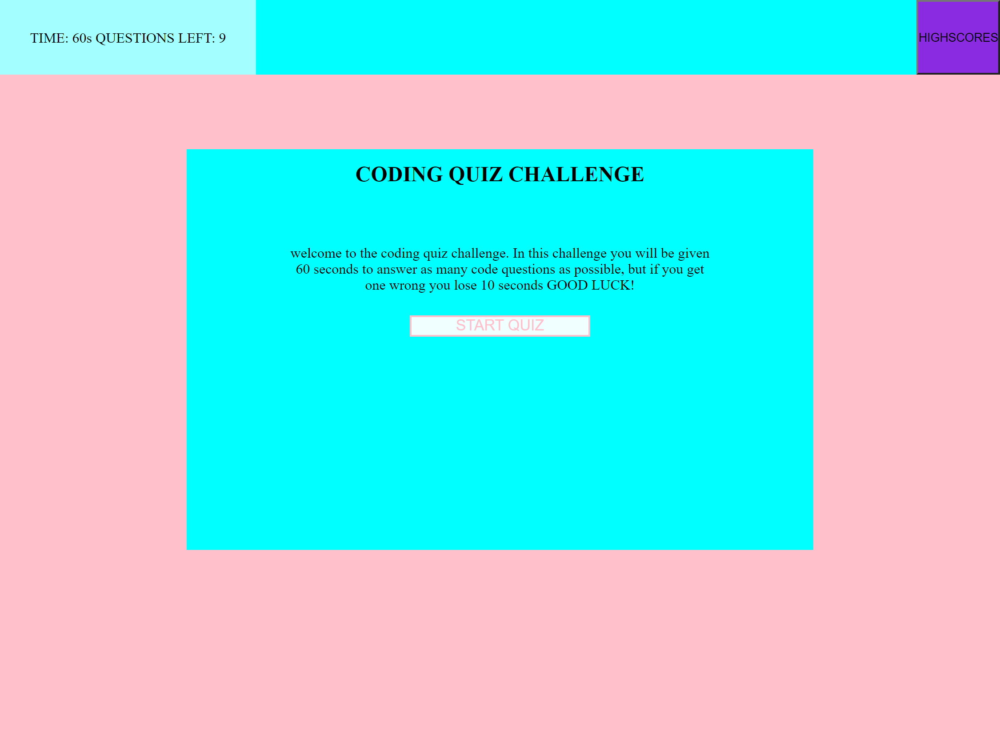

# 04 Web APIs: Code Quiz

## Description 

In this Challenge we were tasked with building a timed coding quiz with multiple-choice questions. This challenge features dynamically updated HTML and CSS powered by JavaScript. Some of these features include: a high-score page accessable through a nav button, dynamic messages and page loading, getting and setting local storage through the browser and a timer that removes time for wrong answers. 

## Mock-Up

## Home Screen

## Quiz In Progress
.png)

## Submit Page
.png)

## High Score Page
.png)

[**GITHUB PAGES LINK**](https://dlonmusk.github.io/code-quiz-challenge/)